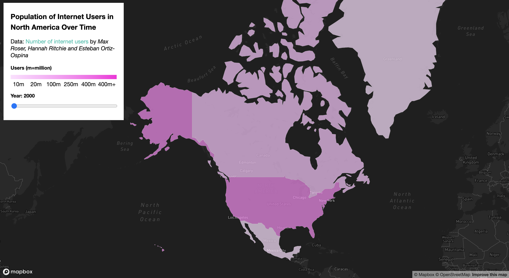
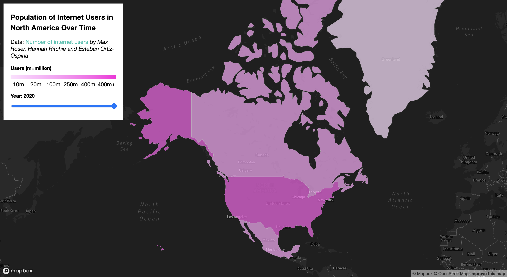

# BA6 Final Project:   Number of Internet Users in North America Over Time

### Project Description:  
An interactive web application which shows a choropleth map of countries in North America, including Canada, USA, Mexico, and Greenland. The application features a time slider which allows the user to change the year between the ranges of 2000 and 2020, which updates the choropleth map to display the corresponding number of internet users in each country for the given year.
 
 
### Project Goal:  
The goal of this application was to illustrate how relatively recently the internet has integrated into society to become a standard of everyday life. Using the time slider, the user is able to see how the number of internet users in North America has grown exponentially across just two decades. The user is also able to see that among countries in North America, the US has been one of the quickest countries to adopt the internet, and that this standard of internet access is not universal, and there are disparities of internet access between countries, even just within this continent. For example, when the user opens the web application, it is easy to notice that the US already has significantly more users than the other countries in North America, even in the early year of 2000. As the time slider increases the year for the map, the US is also seen to have a very high rate of increase, and still has the most internet users in North America today. This information therefore helps people living in industrialized countries to realize that society depends so heavily on internet access nowadays, however, the internet is still a relatively new invention, and many countries around the world are still lacking this tool that many of us take for granted.
 
 
### Project Process & Challenge:  
We have met several difficulties when building the interactive map of the project. The first, also being the major one, was processing data. The data source that we found provided several interesting and useful datasets, but considering size of the dataset, workload, and project scale, we were not able to apply all of them. Thus we had to discuss to select the most suitable one from the data source for our project. After deciding the one dataset we were going to use, we started cleaning it. Becasue every country's number of year recorded was not the same, for example, whilte some were from 1960 to 2020, some were from 1990 to 2020, we decided to cut the number of year uniformly to 2000 to 2020, which was reasonable and relatable being the closest decades to the current year 2022. Another big problem of data processing was how to convert the original csv format to geojson format to both meet the project requirement and make the future coding work eaiser. This step took us much more time than we expected, as we were not just simply converting a csv file to a geojson file that has whatever look. Instead, we needed to make sure this geojson file could be used in our work easily and smoothly.  
The second difficulty we met was how to define a new filter function and a new changing slider. Even though we got the mapbox template to refer, we were doing a different type of map and different unit to the template. As a result, a newly designed filter function based on the slider changing which year is showing is necessary. The third difficulty we met was how to define the appropriate color scale of the choropleth map. Because Greenland's population is significantly lower than other coutries, its data in some way existed as an outlier comparing to other countries. In order to balance the color of Greenland and the color of other three countries, we did make efforts. The last difficulty was applying our custom style of base map. Making the custom base map was not a difficult task itself, using the cutsom base map in the code was neither a hard task as we only needed to copy and paste the link that mapbox provided to us, but it was confusing how to acutally apply the custom base map on the web page. The situation was we did everything but the custom base map just didn't show up on our map. Luckily in the end, we figured out that the mapbox link at the top of html file needs to be updated to the latest version to use the custom map.
 
 
### Web Application link:  
[BA6FinalProject](https://raeoyw.github.io/BA6FinalProject/)
 
 
### Screenshots:

 
 
### Main Functions:  
The user is able to zoom and pan around the map due to the use of map box, and adjust the time slider to view the number of internet users in each country for the years between 2000 and 2020.
 
 
### Data Sources:  
Data for the number of internet users by country over time: https://ourworldindata.org/internet  
Data for Geojson geometry file: https://geojson-maps.ash.ms/
 
 
### Applied Libraries:  
- Mapbox: A map server which offers a wide selection of interactive base maps that can be loaded into web applications using an access token for geographic visualizations.
 
 
### Applied Web Services  
- Github: Used for hosting our web application and uploading our files for collaboration
 
- Basemap: Used alongside Mapbox to create the basemaps seen in our web application
 
- Geo Data Merger: Used for combining Geojson files with CSV data files to assign properties to objects (https://funkeinteraktiv.github.io/geo-data-merger/).
 
 
### Acklowledgements:  
We would like to acklowledge that this web application was created as a project for the University of Washington GEOG 495: Web GIS class instructed by professor Bo Zhao. The authors of this web application are Rae Ouyang, Omar Romero, and Ethan Liu.